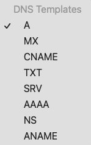

## DNS

---  

### DNS란?
Domain Name System의 약자로 naver.com 같은 문자열 주소를 IP주소로 해석해주는 네크워크 서비스
DNS서버에는 도메인 주소와 IP 주소의 쌍이 저장된다.


### DNS 종류


#### A(ddress) record
DNS에 저장되는 정보의 타입으로 도메인 주소와 서버의 IP주소가 직접 매핑시키는 방식
한번의 요청으로 찾아갈 서버의 IP주소를 알 수 있다.
하지만 하나의 서버에서 여러개의 서브 도메인을 처리하고 있고, 각 서브 도메인을 A record로 등록했다면, 서버가 변경되면 모든 서브 도메인의 A record를 변경해야 한다.
```bash
> nslookup fast.chani.pro
Server:         203.248.252.2
Address:        203.248.252.2#53

Non-authoritative answer:
Name:   fast.chani.pro
Address: 221.147.100.195
```

#### CNAME
Canonical Name으로 도메인 주소를 다른 도메인 주소로 매핑시키는 형태
IP 주소가 자주 변겯되는 환경에서 유연하게 대응할 수 있다는 점에서 A record보다 많이 사용된다.
하지만 실제 IP주소를 얻을 때까지 추가적인 요청이 필요하다.

#### NS record
Name server record로 도메인 주소와 DNS 서버의 도메인 주소를 매핑시키는 형태


#### 예시
|타입|도메인 주소|IP 주소|
|:---:|:---:|:---:|
|A|naver.com|192.168.0.1|
|A|google.com|172.17.0.1|
|CNAME|develop.plusblog.co.kr|dev.plusblog.co.kr|

